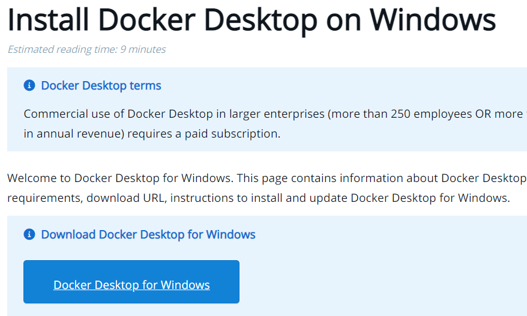
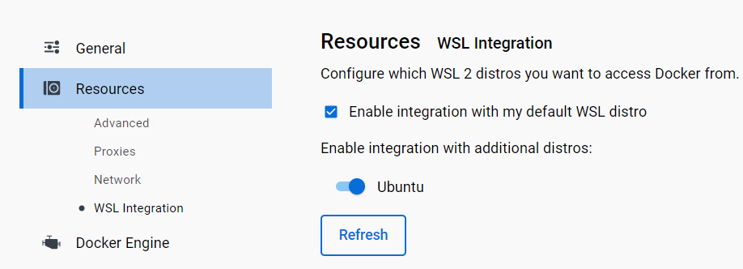

# Docker WSL Setup Guide

This guide provides detailed instructions for installing Docker Desktop with WSL on Windows 10/11 and verifying your installation is working correctly.

## Prerequisites

- Windows 10 (version 2004 or higher) or Windows 11
- Computer that supports Windows Subsystem for Linux (WSL)
- Administrator access to your Windows machine

## Table of Contents

1. [Initial Setup](#initial-setup)
2. [Installation Steps](#installation-steps)
3. [Verification](#verification)
4. [Troubleshooting](#troubleshooting)

---

## Initial Setup

### 1. Register for a DockerHub Account

You'll need a DockerHub account to pull and push Docker images.

**Create your account here:** [https://hub.docker.com/signup](https://hub.docker.com/signup) (free)

### 2. Update Windows

Before proceeding, make sure your Windows OS is fully updated:

1. Open Windows Settings
2. Go to Update & Security
3. Click "Check for updates"
4. Install all pending updates

---

## Installation Steps

### 3. Install WSL

> **Note:** If you have already enabled WSL and installed a distribution, skip to step 7.

1. Open **PowerShell as Administrator**
2. Run the following command:

```bash
wsl --install
```

This command will enable and install all required features and install Ubuntu by default.


**Official Documentation:** [https://docs.microsoft.com/en-us/windows/wsl/install#install-wsl-command](https://docs.microsoft.com/en-us/windows/wsl/install#install-wsl-command)

### 4. Reboot Your Computer

Restart your computer to complete the WSL installation.

### 5. Configure Ubuntu

After rebooting, Windows will automatically launch Ubuntu and prompt you to set up your credentials (if it doesn't, type in "Ubuntu" in the search bar):


- Create a username
- Set a password

**Remember these credentials** - you'll need them for sudo commands.


### 6. Manual Distribution Installation (Optional)

If Windows didn't prompt you to create a distribution or you want to create a new one:

```bash
wsl --install -d Ubuntu
```

### 7. Install Docker Desktop

1. Visit the Docker Desktop installation page: [https://docs.docker.com/desktop/install/windows-install/](https://docs.docker.com/desktop/install/windows-install/)
2. Click the **"Docker Desktop for Windows"** button to download



### 8. Run the Installer

1. Double-click the **Docker Desktop Installer** from your Downloads folder
2. Click **"Install anyway"** if warned the app isn't Microsoft-verified
3. Click **"OK"** to add a desktop shortcut
4. Click **"Close"** when you see the "Installation succeeded" message

### 9. Launch Docker Desktop

1. Double-click the **Docker Desktop** icon on your desktop
2. Accept the Docker Service Agreement


3. Docker Desktop will launch and may present a tutorial (you can skip this)

### 10. Enable WSL Integration

This is a critical step to ensure Docker works with your WSL distributions:

1. In Docker Desktop, click the **Settings** gear icon
2. Navigate to **Resources** → **WSL Integration**
3. Ensure **"Enable integration with my default WSL distro"** is checked
4. If using multiple distributions, toggle them on as well



### 11. Open Your Linux Distribution

1. Use Windows Search in the toolbar
2. Type **"Ubuntu"** (or your distribution name)
3. Click **"Open"**

### 12. Verify Docker Installation

In your Ubuntu terminal, run:

```bash
docker
```

You should see helpful Docker instructions and available commands. If you see this output, Docker is properly installed!


### 13. Log In to Docker

Run the following command in your Ubuntu terminal:

```bash
docker login
```

Enter the username and password you created during DockerHub registration. Once you see **"Login Succeeded"**, your setup is complete!

---

## Verification

### Test Your Docker Setup

To verify everything is working correctly, run:

```bash
docker-compose up --build -d
```

This command will:
- Build your Docker image
- Start your containers in detached mode

### Check the Application

Once the build completes:

1. Open your web browser
2. Navigate to **http://localhost:3000**
3. Your application should be running!

---

## Troubleshooting

### If You Encounter Errors

1. **Check Docker Desktop Terminal**
   - Open Docker Desktop
   - Navigate to the terminal/logs section
   - Look for error messages or warnings

2. **Common Issues:**
   - Ensure WSL integration is enabled in Docker Desktop settings
   - Verify your distribution is running: `wsl --list --verbose`
   - Make sure you're logged into DockerHub: `docker login`
   - Check that Docker Desktop is running

### Need Help?

If you encounter any errors or need assistance, please contact:

**Aleksis Lesieur**

---

## Additional Resources

- [Docker Documentation](https://docs.docker.com/)
- [WSL Documentation](https://docs.microsoft.com/en-us/windows/wsl/)
- [Docker Compose Documentation](https://docs.docker.com/compose/)

---
